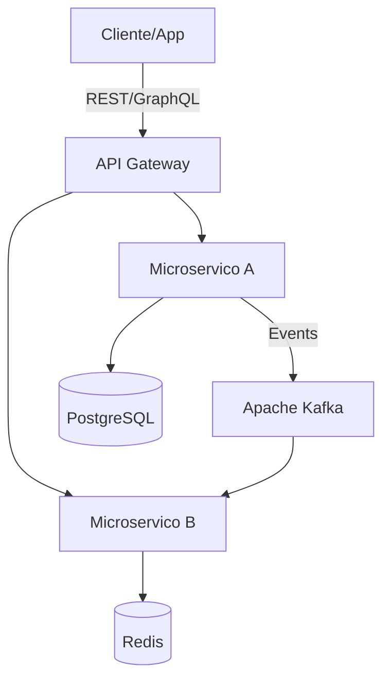

# Architecture

## Visao Geral

Este projeto implementa uma arquitetura de microservicos seguindo os principios de Clean Architecture com separacao clara entre dominio, aplicacao e infraestrutura.

## Decisoes Chave

### Por que Virtual Threads (Project Loom)?

Em servicos bancarios com alta concorrencia (50k+ req/min), o modelo thread-per-request tradicional esgota o pool de threads rapidamente. Virtual Threads permitem milhoes de threads concorrentes sem overhead de memoria, eliminando a necessidade de programacao reativa (WebFlux) na maioria dos casos.

**Resultado em producao:** Reducao de latencia p99 de 800ms para 180ms.

### Por que OpenTelemetry?

Padrao aberto e vendor-neutral. Permite trocar de backend (Jaeger, Zipkin, Datadog) sem mudar codigo. Adotado como padrao em 6 tribos da diretoria.

### Por que Testcontainers?

Testes de integracao contra PostgreSQL e Kafka reais (via Docker) eliminam divergencias entre mock e producao. Cobertura de 85%+ em servicos core.

## Diagramas

### Context (C4 Level 1)

